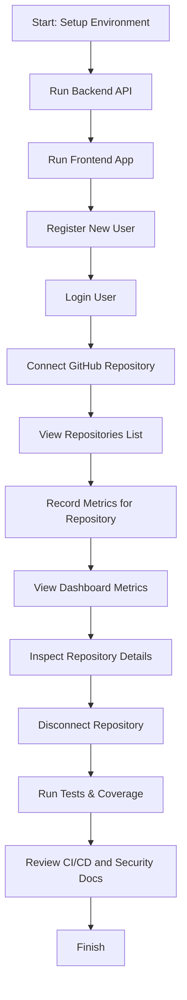

# DevPulse Feature Workflow

This workflow guide helps users and testers validate the DevPulse application feature-by-feature.

## Overview

The workflow covers:
- backend setup and authentication
- GitHub repository connection
- dashboard metrics and repository health
- metrics ingestion and reporting
- frontend UI validation
- security and deployment checks

## Workflow Diagram



> If your Mermaid renderer does not display the diagram, follow the numbered workflow steps below.

## Step-by-Step User & Tester Workflow

### 1. Environment Setup

- Ensure `.NET 7.0+` and `Node.js 18+` are installed.
- Start PostgreSQL locally or use Docker Compose to launch the database.
- Confirm project dependencies are installed:
  - `cd Backend/DevPulse.API && dotnet restore`
  - `cd Frontend && npm install`

### 2. Start Backend

- Navigate to `Backend/DevPulse.API`
- Run:
  ```bash
dotnet run
  ```
- Verify the API is reachable at `https://localhost:7294` or the configured port.

### 3. Start Frontend

- Navigate to `Frontend`
- Run:
  ```bash
npm run dev
  ```
- Verify the frontend loads at `http://localhost:3000`.

### 4. Register a New User

- Open the login page in the browser.
- Use the registration form to create a user with email, password, and optional full name.
- Confirm the API response returns a JWT token.

### 5. Authenticate and Validate Session

- Log in with the newly created user.
- Confirm login success and that the token is stored by the frontend.
- Call `GET /api/auth/validate` with the bearer token and verify `isValid: true`.

### 6. Connect a GitHub Repository

- From the frontend dashboard, choose a GitHub repository owner and name.
- Submit the connection request to `POST /api/repositories/connect`.
- Confirm the response includes the connected repository metadata.

### 7. View Connected Repositories

- Navigate to the repository list page.
- Confirm the connected repository appears with correct name, owner, and URL.
- Verify the `GET /api/repositories` endpoint returns expected repository objects.

### 8. Record Metrics

- Use the frontend or API to send a metrics record to `POST /api/metrics/{repoId}`.
- Provide values for commit count, PR count, issue count, stars, forks, and average PR merge time.
- Confirm the response indicates successful creation.

### 9. View Dashboard Metrics

- Navigate to the dashboard page.
- Confirm aggregated metrics display totals for repositories, commits, PRs, issues, and stars.
- Verify `GET /api/metrics/dashboard` returns an aggregated metrics object.

### 10. Inspect Repository Metrics

- Open repository details.
- Confirm metric history is shown and `GET /api/metrics/{repoId}` returns metric entries.
- Verify the latest metrics endpoint returns the most recent record at `GET /api/metrics/{repoId}/latest`.

### 11. Disconnect Repository

- Remove the repository connection using the frontend or `DELETE /api/repositories/{repoId}`.
- Confirm the repository is no longer present in the repository list.
- Verify the endpoint returns a successful disconnect message.

### 12. Run Tests & Verify Coverage

- Execute backend tests from `Backend`:
  ```bash
dotnet test DevPulse.Tests/DevPulse.Tests.csproj --collect:"XPlat Code Coverage"
  ```
- Confirm test pass results and coverage output.
- For frontend validation, run:
  ```bash
cd Frontend
npm run test
  ```

### 13. Review Documentation and CI/CD

- Confirm `Docs/SPEC.md` describes phases and architecture.
- Confirm `Docs/API.md` documents every endpoint used in workflow.
- Read `Docs/SECURITY-AUDIT.md` for security coverage and recommendations.
- Confirm `.github/workflows/ci.yml` defines backend tests, frontend build, and optional Docker publish.

## Acceptance Checklist

- [ ] Backend API starts successfully
- [ ] Frontend app starts successfully
- [ ] User registration and login work
- [ ] JWT validation succeeds
- [ ] GitHub repository connects successfully
- [ ] Repository list displays connected repos
- [ ] Metrics can be recorded and retrieved
- [ ] Dashboard aggregates metrics correctly
- [ ] Repository details and latest metric endpoints work
- [ ] Repository disconnect works
- [ ] Backend tests run successfully
- [ ] CI workflow file exists and includes tests
- [ ] Security audit and API docs are present

## Notes for Testers

- Use the same JWT token across protected API requests.
- If GitHub repository verification fails, confirm repository owner/name are valid and the GitHub token is configured.
- For local database testing, use a fresh PostgreSQL instance or the provided Docker Compose setup.
- If the Mermaid diagram does not render in your viewer, use the numbered workflow steps above.
